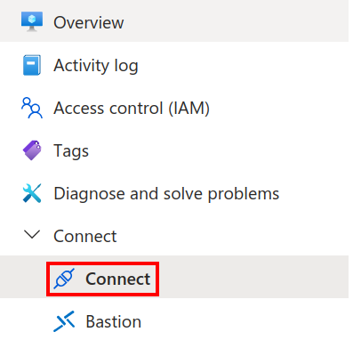

Grist Builder Edition {: .tag-core .tag-ee }
============

Grist Builder Edition is a virtual machine image offered for certain cloud providers. It has everything you need to run a self-hosted Grist instance with minimal setup. It can be found at the following locations:

* [AWS Marketplace](https://aws.amazon.com/marketplace/pp/prodview-tew3ygop5xxy4)
* [Azure Marketplace](https://azuremarketplace.microsoft.com/en-us/marketplace/apps/grist.grist-builder-edition)

Once you select an offering, follow the usual procedure for each cloud provider for starting a virtual machine. You will need to allow SSH access for the virtual machine, as well as HTTP and HTTPS access. This corresponds to TCP network ports 22, 80, and 443 respectively. 

### How to log into the Grist instance

The Grist instance must be managed by SSH or equivalent console access. Details about connecting via SSH can be found in the following places:

* Windows: [https://learn.microsoft.com/en-us/windows/terminal/tutorials/ssh](https://learn.microsoft.com/en-us/windows/terminal/tutorials/ssh)
* Linux: [https://www.ssh.com/academy/ssh/command](https://www.ssh.com/academy/ssh/command)
* macOS: [https://www.servermania.com/kb/articles/ssh-mac](https://www.servermania.com/kb/articles/ssh-mac)

Once you log in, follow the instructions displayed in the console.

If you need some help with the initial configuration, read on below for some specific instructions for each cloud provider.

#### AWS

During deployment, you should have been asked about creating or using key pairs. You can use this pair to log in via SSH from your terminal/bash. The default user for the Grist EC2 instance is named `ubuntu`, and you can log into `ubuntu@[ec2-instance-public-ip]`.

**Note:** You need to use the `*.pem` file you received while generating key pairs on AWS. 

If you don’t want to connect via SSH, AWS provides the option to connect from within the AWS console using the “Connect” button:

#### Azure

When deploying the virtual machine you may be asked to use SSH keys or password, as well as the default user to log in as. The default user is named `azureuser`, and you can login as `azureuser@[azure-vm-public-ip]`.

**Note:** If you choose to use default method of SSH keys, you need to use the `*.pem` file you received when Azure generated key pairs.

There are other methods to connect. Click on the "Connect" tab in the virtual machine's sidebar in the Azure web portal if you need other options.

## Authentication setup

In addition to username and password logins via [Authelia](https://www.authelia.com/), we also support Google or Microsoft as OpenID providers. For configuring other authentication providers, please refer to the [dex documentation](https://dexidp.io/docs/getting-started/).

To configure Grist authentication with Google or Microsoft, you must have an application registered with the corresponding provider:

* Microsoft: [https://learn.microsoft.com/en-us/power-pages/security/authentication/openid-settings](https://learn.microsoft.com/en-us/power-pages/security/authentication/openid-settings)
* Google: [https://support.google.com/cloud/answer/6158849?hl=en](https://support.google.com/cloud/answer/6158849?hl=en)

## Other important information 

* The Grist EC2 instance should have the “Persistent store” option checked.
* By default, Grist Builder Edition stores cryptographic authentication configuration and all data under `/home/grist/persist`. Deleting this folder will result in a loss of all data from all documents.
* If you are using the legacy version based on [Grist Omnibus](https://github.com/gristlabs/grist-omnibus), please refer to the [legacy documentation](aws-marketplace-legacy.md).
